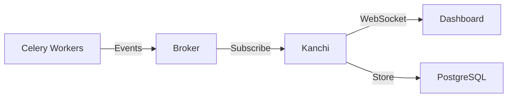
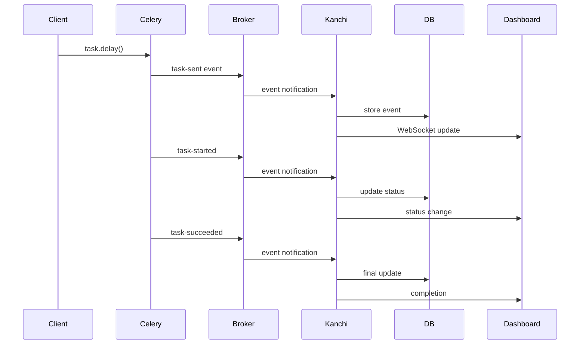

import { Callout } from 'fumadocs-ui/components/callout';
import { Card, Cards } from 'fumadocs-ui/components/card';

## System Overview

Kanchi is built as a standalone monitoring service that connects to your Celery broker and captures all task events in real-time.



## Core Components

### Event Capture Service

The event capture service connects to your Celery broker and subscribes to all task events:

- **Task Sent**: When a task is submitted
- **Task Started**: When a worker begins execution
- **Task Succeeded**: When a task completes successfully
- **Task Failed**: When a task raises an exception
- **Task Retried**: When a task is retried
- **Worker Online/Offline**: Worker lifecycle events
- **Worker Heartbeat**: Periodic health signals

### Event Processing Pipeline

```
Event → Validation → Enrichment → Storage → WebSocket Broadcast
```

1. **Validation**: Ensure event integrity
2. **Enrichment**: Add metadata and relationships
3. **Storage**: Persist to database
4. **Broadcast**: Push to connected clients

### Real-Time WebSocket Server

Kanchi uses WebSockets for real-time updates:

- **Zero Polling**: Push-based updates
- **Efficient**: Smart event deduplication
- **Scalable**: Handles thousands of concurrent connections

### Database Layer

PostgreSQL stores all historical data:

- **Indexed Queries**: Fast search and filtering
- **Connection Pooling**: Efficient resource usage
- **Migrations**: Schema versioning with Alembic
- **Partitioning**: Optional for high-volume deployments

## Technology Stack

### Backend

- **FastAPI**: High-performance Python web framework
- **SQLAlchemy**: ORM with async support
- **Kombu**: Celery event subscription
- **Pydantic**: Data validation and serialization
- **WebSockets**: Real-time communication

### Frontend

- **Next.js**: React framework with SSR
- **TypeScript**: Type-safe development
- **TanStack Query**: Data fetching and caching
- **Tailwind CSS**: Utility-first styling
- **Framer Motion**: Smooth animations

### Infrastructure

- **PostgreSQL**: Primary data store
- **Redis/RabbitMQ**: Celery broker (your existing one)
- **Docker**: Containerized deployment

## Event Flow

### Task Lifecycle



## Data Model

### Core Entities

**Task Event**
```python
{
  "task_id": "uuid",
  "name": "tasks.process_data",
  "state": "STARTED",
  "args": [...],
  "kwargs": {...},
  "worker": "worker@hostname",
  "timestamp": "2025-01-15T10:30:00Z",
  "runtime": 1.23
}
```

**Worker**
```python
{
  "hostname": "worker@node-1",
  "status": "online",
  "active_tasks": 5,
  "processed": 1234,
  "load_average": [1.5, 1.3, 1.2],
  "last_heartbeat": "2025-01-15T10:30:00Z"
}
```

**Workflow Rule**
```python
{
  "name": "Retry failed tasks",
  "trigger": {
    "event": "task.failed",
    "filters": [...]
  },
  "actions": [
    {"type": "retry"},
    {"type": "webhook", "url": "..."}
  ]
}
```

## Scalability

### Horizontal Scaling

Kanchi supports horizontal scaling for high-volume deployments:

- **Multiple Instances**: Deploy multiple Kanchi instances
- **Load Balancing**: Use a load balancer for the web interface
- **Shared Database**: All instances share PostgreSQL
- **Event Deduplication**: Built-in to prevent duplicates

### Performance Optimizations

- **Event Batching**: Group database writes
- **Connection Pooling**: Efficient database connections
- **Caching**: Redis cache for frequently accessed data
- **Indexing**: Optimized database indexes

### Resource Requirements

**Minimum** (Development):
- 512MB RAM
- 1 CPU core
- 1GB disk

**Recommended** (Production):
- 2GB RAM
- 2 CPU cores
- 10GB disk (scales with retention period)

**High Volume** (>1000 tasks/sec):
- 4GB+ RAM
- 4+ CPU cores
- 50GB+ disk
- PostgreSQL tuning

## Next Steps

<Cards>
  <Card href="/docs/getting-started/installation" title="Installation" description="Install Kanchi" />
  <Card href="/docs/configuration/overview" title="Configuration" description="Configure Kanchi" />
  <Card href="/docs/deployment/production-ready" title="Deployment" description="Deploy to production" />
  <Card href="/docs/api/introduction" title="API Reference" description="Explore the API" />
</Cards>
